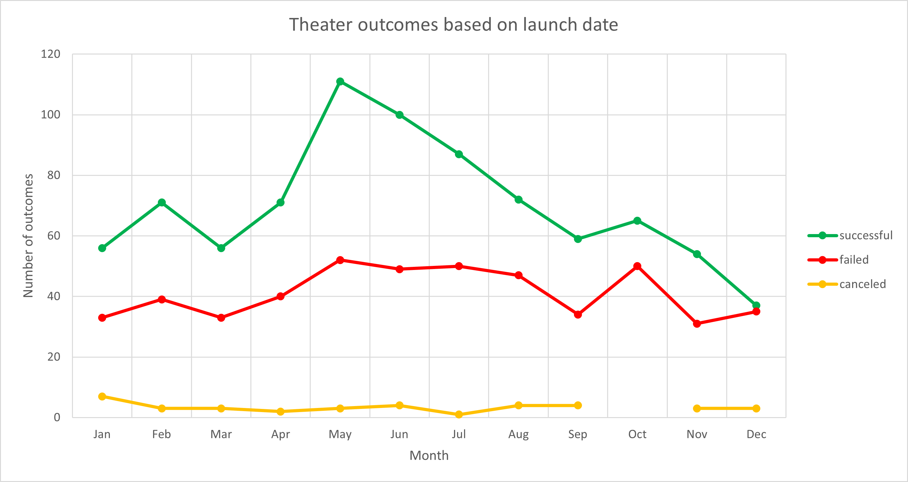
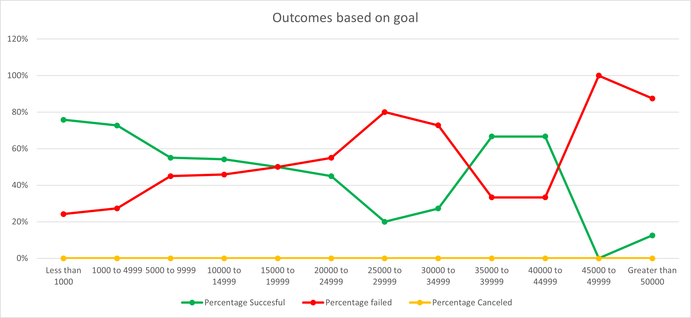

# Kickstarter-analysis
## Overview of Project
### Purpose
The purpose of this analysis is to bring relieable information about kickstarter campaigns based on collected data from succesful, failed and canceled campaigns in order to make decisions for future endeavors.

- Firstable we are focusing on the category: **theater**, by looking at historical data of the outcome of campaigns by launch date (month).
- Secondly, we are focusing on the subcategory: **plays**, by lookin at the outcomes of the campaigs based on the goals stablished for such.

### Analysis of Outcomes Based on Launch Date

Based on the data it seems that no matter the month, theather campaigs are succesfull as they have more success outcomes than failedones, however there are certain months were this type of campaings are more succesfull than the rest of the year, months such as April, May, Jun and July (second quarter of the year) have a higher success rate where practically 2 out of 3 campaigs launched during that period are succesfull, on the other hand months such as October, November and December (fourth quarter) show a decline on their succes rate practically 1 out of 2 campaigns are succesfull where  December is the worst month to launch a theater campaign.

### Analysis of Outcomes Based on Goals

There are a few set of goal ranges where a play campaign can be succesful, campaings with a goal between less than $1000 to $4999 have the highest succes rate with an average of 74% succes rate, and campaigns with a goal range between $35000 and $44999 have an average of 67% succes rate, however campaigs with a goal range between $20000 and $34999 tend to failed more with succes rate of only 31% meaning that there are more failed campaigns than succesfull campaigns within this range and campaigs with a goal higher than $45000 have the lowest succes rate of all with an average of 6% succes rate.

### Challenges and Difficulties Encountered

A few on the challenges encountered was the neccesity to add additional rows with specific calclations to the data set given, also another chalenged that was encountered was the revision or validation of information with formulas that were used to throw the **analysis of outcomes based on goals** as we have to make sure that the formulas used worked as intended and are showing the required information.

## Results

- What are two conclusions you can draw about the Outcomes based on Launch Date?

The second quarter of the year is the best period of the year to launch theather campaigs.

The fourth quarter of the year is the worst period of the year to launch theather campaigns.

- What can you conclude about the Outcomes based on Goals?

Even if the goal range of less than $1000 to $4999 has the highest succes rate, a campaign that is launched with goal range between $35000 and $44999 has almost the same succes rate and as the goal is higher the pledged amounts are also higher wich makes it the most realiable goal range, and also is preferable to avoid campaigs with a higher goal than $50000 as their succes rate is almost non existant.

- What are some limitations of this dataset?

Some campaigns are still *live*, depending on their outcome it could modify our current analysis.

- What are some other possible tables and/or graphs that we could create?

We could take a look at the success rate by country, pledeged amounts by month  or pledged amount byu country to mention some.
